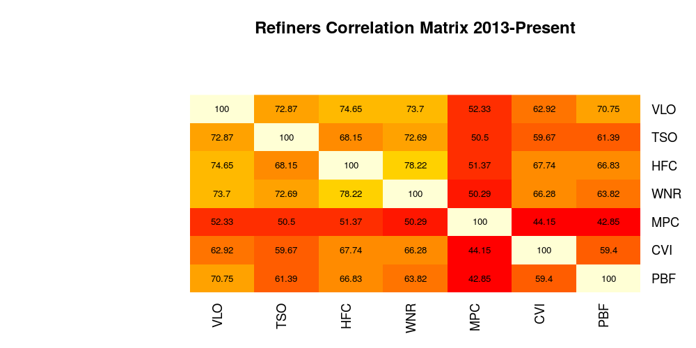

#Time Series Heatmaps

<h3> Heat Map for Equitiy Time Series using Quantmod </h3>
<h3>Heat Map for Equity correlation matrix using Quandl</h3>


#Libraries

```{r}
#for stock prices heatmap
require(ggplot2)
require(quantmod)
require(reshape2)
require(plyr)
require(scales)
```

```{r}
#For correlations heatmap
require(gplot)
require(Quandl)
require(xts)
```

###Plots
 
